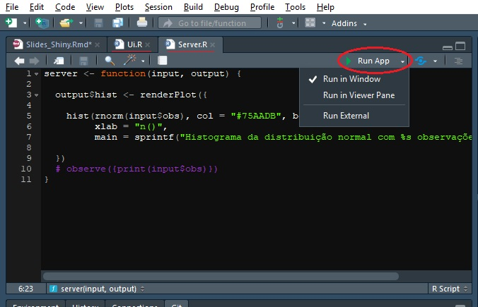

```{r setup, include=FALSE}
knitr::opts_chunk$set(echo = FALSE)
knitr::opts_chunk$set(warning = FALSE)
```


## Passo a passo de uma análise estatística/dados.

1. Planejamento da análise
2. Coleta e/ou mineração dos dados
3. Análise descritiva
4. Análise inferencial/modelagem
5. Apresentação.

## Pacotes uteis:
```{r, echo = T}
# library(shiny) #Shiny - indispensável
# library(DT) #Tabelas bonitas e interativas - opcional
# library(plotly) #Gráficos bonitos e interativos - opcional
# library(shinydashboard) #Deixa seu shiny estiloso - opcional
```


## O que é o Shiny?

Shiny é um pacote do R que torna fácil a construção de uma aplicação interativa via web.

Através do shiny é possível criar dashboards que facilitam a comunicação e apresentações de uma análise de dados.

## Tutorial completo do RStudio sobre Shiny.

[Tutorial](https://shiny.rstudio.com/tutorial/)


## O que é o Shiny?


## Exemplo de aplicação Shiny:

[Exemplo](https://shiny.rstudio.com/gallery/)


## Construindo uma aplicação


## Template

1. Usar o template:


## Template
<br/>
<br/>

* *Ui.R* - Constrói a User Inteface, isto é, a **arquitetura** da página.  

* *Server.R* - Constrói as reações, interações, dinamismo.  


## Exemplo 1:
 No R
 
 
## Inputs e Outputs

**Inputs** são widgets que possibilitam a interação do usuário com o App.  

**Outputs** é a resposta que o app dará às ações exercidas pelo usuário através do **input**


## Funções inputs:


## Sintaxes:


## Funções Outputs:


## Sintaxe:


## Recaptulando:


## Exemplo 2:

No R


## Server.R

Para a construção do Server.R são necessárias apenas 3 regras:


## Server.R


## Server.R


## Server.R


## Server.R


## Server.R


## Compartilhando seu app

Todo aplicativo Shiny é alimentado por um computador rodando R.


## Compartilhando seu app
  
Será necessário:

1. Um diretório contendo tudo o que seu app utiliza (datasets, imagens, etc)

2. O código em R que gera seu app (Ui.R e Server.R)

## Compartilhando seu app



## Outros métodos de compartilhamento

* Servidor comum.
* Shinyapps.io
* Construa seu próprio Shiny Server.

## Exemplo 3: DT

No R

## Exemplo 4: plotly

No R


## Exercício para casa:

* Utilize o dataset **iris** 
* Utilize a biblioteca ggplot2 para criação dos gráficos (estude)

1. Crie um app que tenha como *inputs* duas colunas **quaisquer** do dataset **iris** e devolva como *output* um gráfico ggplot de dispersão entre estas colunas escolhidas.

2. Crie um outro *input* que dê a opção do usuário visualizar a reta de regressão linear simples formada entre as variáveis (colunas) escolhidas. (Dica: função *geom_smooth* de ggplot2).


