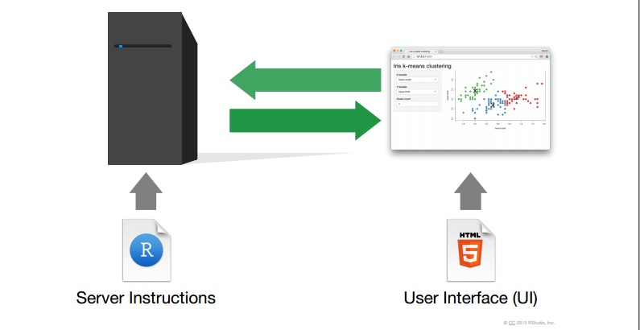
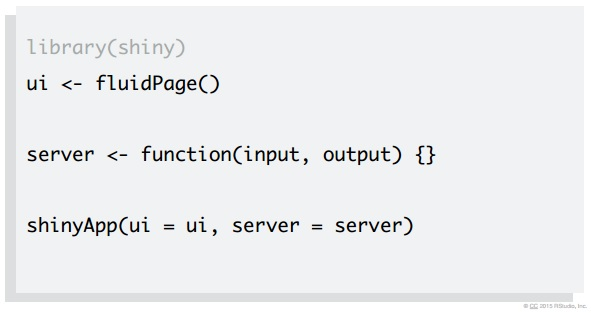
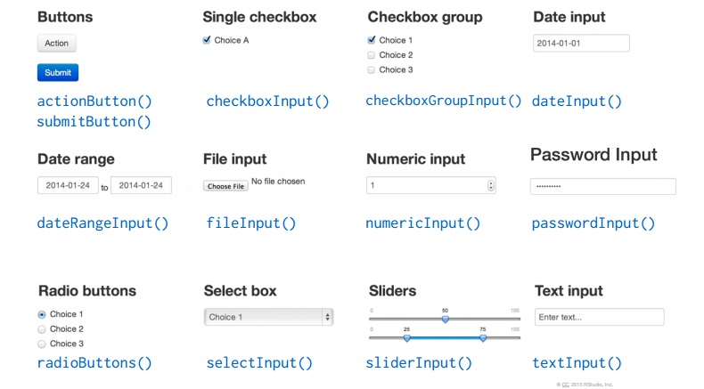
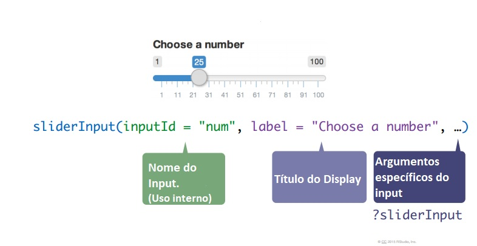
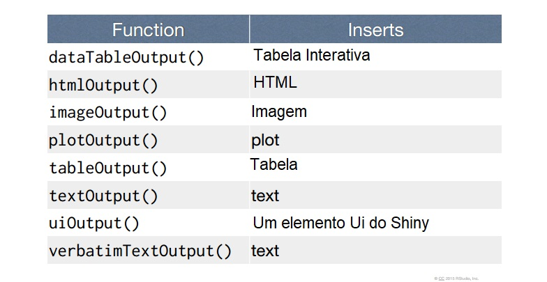
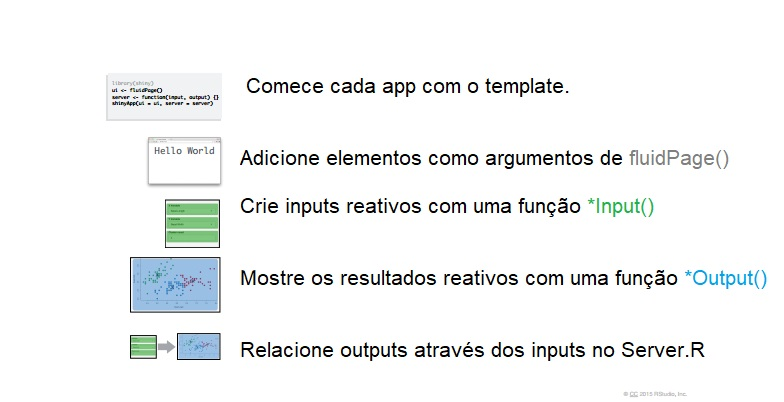
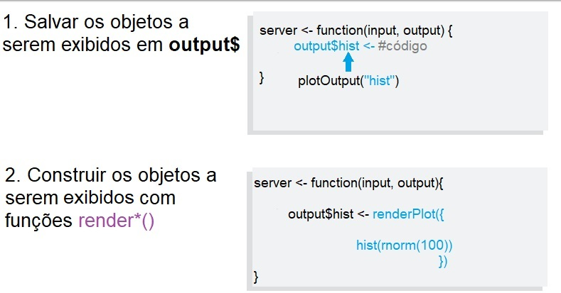
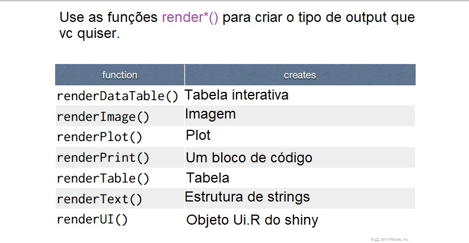
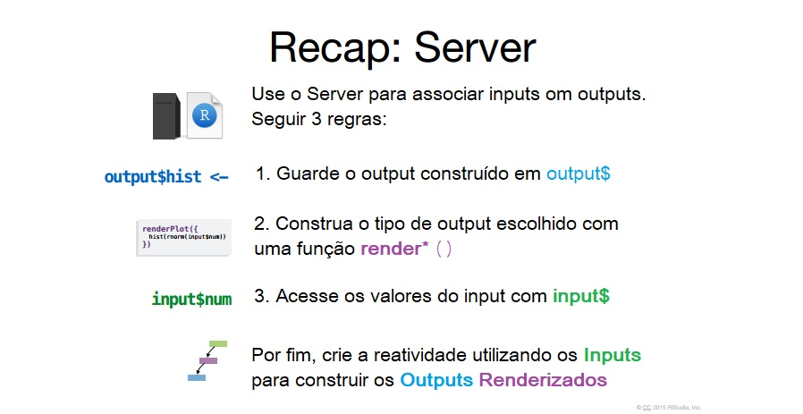

```{r, include = FALSE}
knitr::opts_chunk$set(echo = FALSE)
```


# Ciclo da ciência de dados

<br>
<br>
<br>

```{r, fig.align='center'}
knitr::include_graphics("https://raw.githubusercontent.com/hadley/r4ds/master/diagrams/data-science.png")
```

---

## O que é o Shiny?

- Sistema para desenvolvimento de aplicações web usando o R.

- Um pacote de R (`shiny`).

- Um servidor web (`shiny server`).

---

## O que o Shiny não é?

- O Shiny **não** é uma página web.

- O Shiny **não** é um substituto para sistemas mais gerais, como Ruby on Rails e Django.

- O Shiny **não** é uma ferramenta gerencial, como o Tableau.
---

## Tutorial completo do RStudio sobre Shiny

- [Tutorial](https://shiny.rstudio.com/tutorial/)

- [Exemplos](https://shiny.rstudio.com/gallery/)

---

## Como funciona?


---

## Template

1. Usar o template:



---

## Template

<br/>
<br/>

* *Ui.R* - Constrói a User Inteface, isto é, a **arquitetura** da página.  

* *Server.R* - Constrói as reações, interações, dinamismo.  

---

## Exemplo 1

Vamos para o R!

---
 
## Inputs e Outputs

**Inputs** são widgets que possibilitam a interação do usuário com o App.  

**Outputs** é a resposta que o app dará às ações exercidas pelo usuário por meio dos **inputs**.

---

## Funções inputs


---

## Sintaxe



---

## Funções Outputs



---

## Sintaxe


---

## Recaptulando




---

## Exemplo 2

Vamos para o R!

---

## Server.R

Para a construção do Server.R são necessárias apenas 3 regras:

---

## Regras da função server()



---

## Funções render*()



---

## Sintaxe


---

## Regras da função server()


---

## Recapitulando



---

## Compartilhando seu app

Todo aplicativo Shiny é alimentado por um computador rodando R.


---

## Compartilhando seu app
  
Será necessário:

1. Um diretório contendo tudo o que seu app utiliza (datasets, imagens etc).

2. O código em R que gera seu app (app.R).

Opções:

* Servidor comum
* [shinyapps.io](http://www.shinyapps.io/)
* Construa seu próprio Shiny Server

---

## Exemplo 3 e 4: DT e plotly

Vamos para o R!

---

## Exercício

* Utilize o dataset `iris`.
* Utilize o pacote `ggplot2` para criação dos gráficos.

1. Crie um app que tenha como *inputs* duas colunas **quaisquer** do dataset **iris** e devolva como *output* um gráfico ggplot de dispersão entre estas colunas escolhidas.

2. Crie um outro *input* que dê a opção do usuário vizualizar a reta de regressão linear simples formada entre as variáveis (colunas) escolhidas. (Dica: função *geom_smooth()* de ggplot2).


